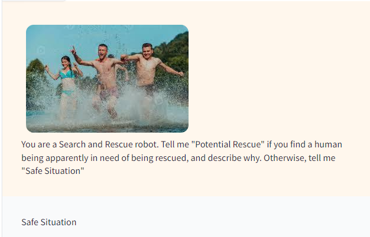

#   DGMD E-17 Robotics, Autonomous Vehicles, Drones and Artificial Intelligence

## Final Project - Search and Rescue in Duckietown

**Harvard University, Spring 2024**<br/>
**Instructor:** Nabib Ahmed <br/>
**Teaching Assistant:** Marwah Aman<br/>

**Team: The Killer Robots**:

* Artemio Mendoza
* Nathaniel Roe (with support from GPT4-turbo programming assistant)
* Sidharta Roy

Welcome to our project to design and construct an autonomous Duckiebot capable of navigating through a simulated environment known as Duckietown. Our Duckiebot's mission is to identify and report the locations of "victims" marked by distinct visual cues, such as colored shapes or QR codes. This endeavor showcases core robotics principles, including autonomous navigation and object recognition, all within a simulated search and rescue scenario.

<a id="contents"></a>
## Table of Contents

1. [Project Summary](#summary)
2. [How does it work?](#how-does-work)
3. [Technologies and Methods](#technologies-and-methods)
4. [Solution Architecture](#solution-architecture)
5. [Project Components](#project-components)
    - 5.1 [Clone Repository](#clone-repo)
    - 5.2 [Project Proposal](#proposal)
    - 5.3 [Ethics Concerns](#ethics)
    - 5.4 [Initial Demo](#initial-demo)
6. [Software Components](#software-components)
7. [References](#references)


<a id="summary"></a>
## Project Summary
[Return to Table of Contents](#contents)

This project involves the design and construction of an autonomous Duckiebot that is capable of navigating a simplified Duckietown environment. The primary objective is for the Duckiebot to locate and report the locations of "victims" identified by distinct visual cues, such as colored shapes or QR codes. Utilizing LLaVA, an OpenSource, Multimodal Large Language Model (LLM), the Duckiebot will also be able to identify hazardous situations potentially involving human victims. 

The acquired data is uploaded to AWS S3 for further analysis.

This project aims to demonstrate essential robotics principles, including autonomous navigation and object recognition, within a simulated search and rescue scenario. 

### Objective

This project aims to apply fundamental robotics principles in practical contexts by using Robotic Systems, Artificial Intelligence, and cloud computing. It emphasizes hands-on experience with autonomous navigation, computer vision, and cloud-based data processing using Duckietown as the base robotic platform.  

This initiative provides a comprehensive learning experience in autonomous systems, machine vision, and cloud-based analytics, showcasing how robotics can be harnessed for innovative solutions in simulated rescue operations.

### Background

Duckietown is an open-source platform used for research and education in autonomous robotics.

This project builds on these foundations by focusing on a rescue simulation scenario, which, while simplified, introduces the real-world application of robotics in search and rescue operations. 

This initiative provides a comprehensive learning experience in autonomous systems, machine vision, and cloud-based analytics, showcasing how robotics can be harnessed for innovative solutions in simulated rescue operations.

<a id="how-does-work"></a>
## How does it work?
[Return to Table of Contents](#contents)


1) It starts with the robot being deployed in a disaster environment. Note: in our case, the environment is Duckitown, a controlled city with landmarks. So far, our environment is reduced to this track but we will have a bigger "city" in place.


    </img>


2) Once deployed, the robot is capable of walking following the edges of the terrain. This is how the robot "sees" the terrain.

    </img>


3) The images from the robot's vision are real-time downloaded and then uploaded to Google Drive API. The uploaded images are then analyzed using YOLOV5 to determine if there are humans in the picture.  That picture is stored in the controller workstation to be analyzed concerning danger. Note: while the Duckiebot platform takes control of navigation, object detection is done on a different device.


    - 3.1 Example of human recognition (photo of the leg). The on-board camera images are streamed, saved, and analyzed off-board to determine if there are humans present in the current robot view.
        
        Pre YOLO model analysis (uploaded image from Duckiebot Dashboard) 

        </img>
    
        Post YOLO model analysis

        </img>

        Further LLM analysis to understand the environment

    - 3.2 People detected (Case I)

    </img>

    - 3.3 People detected (Case II)

    </img>
.


4) When the controller workstation detects an image, it is input to the local LLM API for classification. The output is either a "Safe situation" or a "Potential Rescue". In the second case, the model returns a description of the hazard, to help the rescue team. 

    - 4.1 Case I: Situation classified as Safe by the LLM (the text below was generated automatically by the LLM model)


        </img>


    - 4.2 Case II: Situation classified as a Potential Hazard (the text below was generated automatically by the LLM model)

        </img>


5) If the situation is a Potential Rescue, then the robot uploads the image to AWS for log and further analysis. Also, it signals a human operator to take control of the robot and make a decision. 

    </img>

6) If there is no danger, then the robot keeps looking for victims. 


<a id="technologies-and-methods"></a>
## Technologies and Methods
[Return to Table of Contents](#contents)

#### Hardware

* NVIDIA Jetson Nano 4GB with GPU (CUDA)
* Video camera (onboard)
* Differential Driver, 2-wheeled robot, with encoders.
* Customized Duckietown setup, modified for search and rescue
* Wifi Antenna and Receiver

#### Software

* Python for programming control scripts, and interacting with AWS
* LLaVA, a Multimodal LLM model; designed to identify dangerous scenarios
* OpenCV for computer vision and image processing functions
* ROS for coordinating sensor data and actuator commands
* AWS Services  - Cloud integration for AI advanced Image processing
* Docker - to access Duckietown image with basic commands
* YOLOV5 for Image Recognition

#### Methods

* Implement algorithms for navigating around the track
* Convolutional Neural Network, YOLOV5
* Deep Learning/Computer Vision techniques for victim identification
* Data logging and visual indication for reporting
* Image capture and transference to AWS cloud 
* Use of advanced image processing and data management via AWS

<a id="solution-architecture"></a>
## Solution Architecture
[Return to Table of Contents](#contents)

* Our SAR system employs an autonomous Duckiebot with NVIDIA Jetson Nano, using YOLOV5 CNN for real-time victim detection. 

* We use a State of The Art (SOTA) Large Language Model, LLaVA, to identify possible hazardous situations via image capture. The image is not only classified, but also, the potentially dangerous situation is described, so the rescue team could have context.

* The images classified as dangerous are uploaded to AWS for advanced analysis and logging.

 </img>

<a id="project-components"></a>
## Project Components
[Return to Table of Contents](#contents)


<a id="clone-repo"></a>
### Clone Repository:
```bash
 git clone https://github.com/dgmd-e-17/sar_final_project.git
```

<a id="proposal"></a>
### Proposal presentation

[This video shows our project proposal](https://drive.google.com/file/d/1viS06114cGnm_ffIdsgWONALd-dSAewz/view?usp=sharing). This is the video shown during the initial proposal presentations.

Also, a detailed version with only [the slides of the proposal can be found here.](https://docs.google.com/presentation/d/1ApG4v_wA1hNNz_CjFQiBxmGrkqtl3VUr9AUES8yy6bY/edit?usp=sharing) 


<a id="ethics"></a>
### Ethical concerns

In pursuing this project, we've identified key ethical concerns, including privacy invasion, data security, and asymmetric access to this technology. Our objective is not only to address these issues but also to implement solutions that safeguard ethical standards in robotic applications.

In [this video, we discuss the ethical risks, and our proposals to mitigate them.](https://drive.google.com/file/d/1NpLR-ls4MPzgKr46cRcsTqLPc-I7vtRc/view?usp=sharing) 

<a id="initial-demo"></a>
### Initial Demo


[In this video, we show our initial demo for this project.](https://drive.google.com/file/d/1mANGDkZWNS8z_Lt5EwcjJfY_FaxLYwTc/view?usp=sharing) This is the status of the project as of 04/19/2024, and there is still a work in progress, with several components to be added and refined.

<a id="software-components"></a>
## Software Components
[Return to Table of Contents](#contents)

### Building Instructions and Manual
- We built a DuckieBot for this project. As well, we used a duckitown city for navigation. [The building instructions and the use manual are in this repository:](gym-duckietown/README.md). Note: this is a fork for the Duckietown GitHub repository.


### MLL Implementation - LLaVA Component

* We decided to use a novel approach to classify the situation. Instead of training and deploying a classical Convolutional Neural Network to label the image, we decided to locally implement a SOTA LLM, that will not only classify the images but provide a description of the situation. 

    Gitub Repository: https://github.com/haotian-liu/LLaVA

**Start LLaVa Services**<br/>
Note: *Instructions and image taken from Github Repository above*

The LLM model is deployed locally and can be used either via web interface or as a CLI command. In either case, we need the following infrastructure. 


* Start Controller
```python
python -m llava.serve.controller --host 0.0.0.0 --port 10000
```

* Launch Gradio WebServer
```python
python -m llava.serve.gradio_web_server --controller http://localhost:10000 --model-list-mode reload
```

* Launch a model Worker
```python
python -m llava.serve.model_worker --host 0.0.0.0 --controller http://localhost:10000 --port 40000 --worker http://localhost:40000 --model-path liuhaotian/llava-v1.5-13b
``` 

### AWS Components

- The source code for uploading files to AWS is located in [./AWS/src/uploads_aws.py](aws_component/src/upload_aws.py)

#### Usage:  upload image 

script files:
    ```
    src/env_vars.sh
    src/upload_aws.py
    ```
usage:

1) move to source directory

    ```bash
    cd aws_components\src
    ```

2) load env variable by running shell script

    ```bash
    $ source ./env_vars.sh
    ```

3) execute CLI command

    ```bash
    └─ $ ▶ python upload_aws.py ./data/test_file_1.txt 
    File was uploaded successfully.
    ```

<a id="references"></a>
## 6. References
[Return to Table of Contents](#contents)

* Duckietown Project Documentation and Resources. The official Duckietown documentation offers comprehensive guides on setting up Duckiebots, programming them, and understanding the Duckietown environment: https://docs.duckietown.org/

* Visual Instruction Tuning. *Haotian Liu, et al*. https://arxiv.org/html/2304.08485v2

* LLaVA: Large Language and Vision Assistant. Visual Instruction Tuning. NeuriIPS 2023 (Oral). Haotian Liu, et al. https://llava-vl.github.io/

* OpenCV Documentation.  The OpenCV library is crucial for computer vision tasks. The official documentation provides tutorials, guides, and API references for implementing various computer vision algorithms, essential for object recognition in robotics:  https://docs.opencv.org/master/

* Robot Operating System (ROS). Provides tools and libraries to help software developers create robot applications, from simple robots to complex autonomous systems. https://www.ros.org

* AWS AI Services. AI cloud-based ML and DL-based services. These services enable developers to add intelligence to their applications without requiring deep expertise in AI. https://aws.amazon.com/machine-learning/ai-services/
